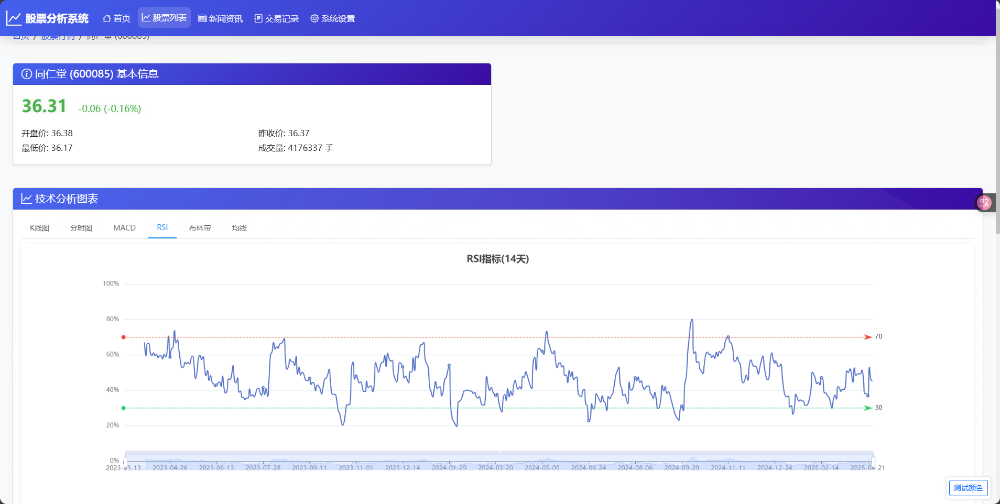

# 股票分析系统

一个基于Python的股票分析系统，集成了实时数据监控、技术分析、自动交易和新闻分析等功能。

## 功能特点

### 1. 实时数据监控
- 支持多只股票同时监控
- 实时显示价格、涨跌幅、成交量等数据
- 提供分时图和K线图展示
- 自动更新实时数据

### 2. 技术分析
- 支持多种技术指标计算（MACD、RSI、布林带等）
- 提供技术指标图表展示
- 支持自定义技术指标参数

### 3. 自动交易
- 集成同花顺交易接口
- 支持自动买卖操作
- 可配置交易参数和限制
- 提供交易记录查看

### 4. 凯利公式仓位管理
- 基于凯利公式的仓位计算
- 可配置风险参数
- 支持半凯利模式
- 自动计算最优仓位

### 5. 新闻分析
- 实时抓取股票相关新闻
- 支持多来源新闻聚合
- 提供新闻情感分析
- 可配置新闻过滤规则

## 系统要求

- Python 3.8+
- MySQL 5.7+
- Redis 6.0+
- Windows 10/11（同花顺交易支持）

## 安装步骤

1. 克隆项目到本地：
```bash
git clone https://github.com/yourusername/stock-analysis.git
cd stock-analysis
```

2. 安装依赖包：
```bash
pip install -r requirements.txt
```

3. 配置数据库：
- 创建MySQL数据库：
```sql
CREATE DATABASE stock_analysis CHARACTER SET utf8mb4 COLLATE utf8mb4_unicode_ci;
```
- 配置数据库连接信息（修改config.json中的mysql_config部分）

4. 配置Redis：
- 安装并启动Redis服务
- 配置Redis连接信息（修改config.json中的redis_config部分）

5. 配置同花顺交易：
- 安装同花顺交易软件
- 修改ths_config.json中的配置信息

## 使用说明

### 1. 启动系统

```bash
python manage.py runserver
```

运行一下文件前请先修改config.json，kelly_config.json，ths_config.json配置文件

运行：stock_real_data.py，kelly_position_manager.py，hot_News_data.py，indicators_analysis.py，stock_analysis_decision.py文件

如果需要自动交易则运行ths_auto_trader.py

### 2. 添加股票

1. 访问系统设置页面

2. 在"股票管理"选项卡中添加股票

3. 输入股票代码、名称和行业信息

   

### 3. 配置交易参数
1. 在"同花顺配置"选项卡中设置：
   - 同花顺软件路径
   
   - 交易限制参数

   - 重试次数等
   
     
   
2. 在"凯利公式配置"选项卡中设置：
   - 默认胜率
   
   - 最大仓位比例
   
   - 止损止盈比例
   
   - 资金管理参数
   
     

### 4. 查看数据
- 首页：查看所有监控股票的基本信息

  

- 股票详情页：查看具体股票的技术指标和图表

  

  

  

  

  

- 交易记录页：查看历史交易记录

  

- 新闻列表页：查看相关新闻和分析

  

## 注意事项

1. 使用自动交易功能前，请确保：
   - 同花顺交易软件已正确安装
   - 交易账户已登录
   - 交易参数已合理配置
   - MySQL，Redis数据库已经配置
2. 风险提示：
   - 本系统仅供学习和研究使用
   - 实际交易请谨慎操作
   - 建议使用模拟账户进行测试

## 更新日志

### v1.0.0 (2025-05-01)
- 初始版本发布
- 实现基本功能：
  - 股票数据监控
  - 技术分析
  - 自动交易
  - 凯利公式仓位管理
  - 新闻分析

## 贡献指南

欢迎提交Issue和Pull Request来帮助改进项目。

## 联系方式

如有问题或建议，请联系：1992002335@qq.com
